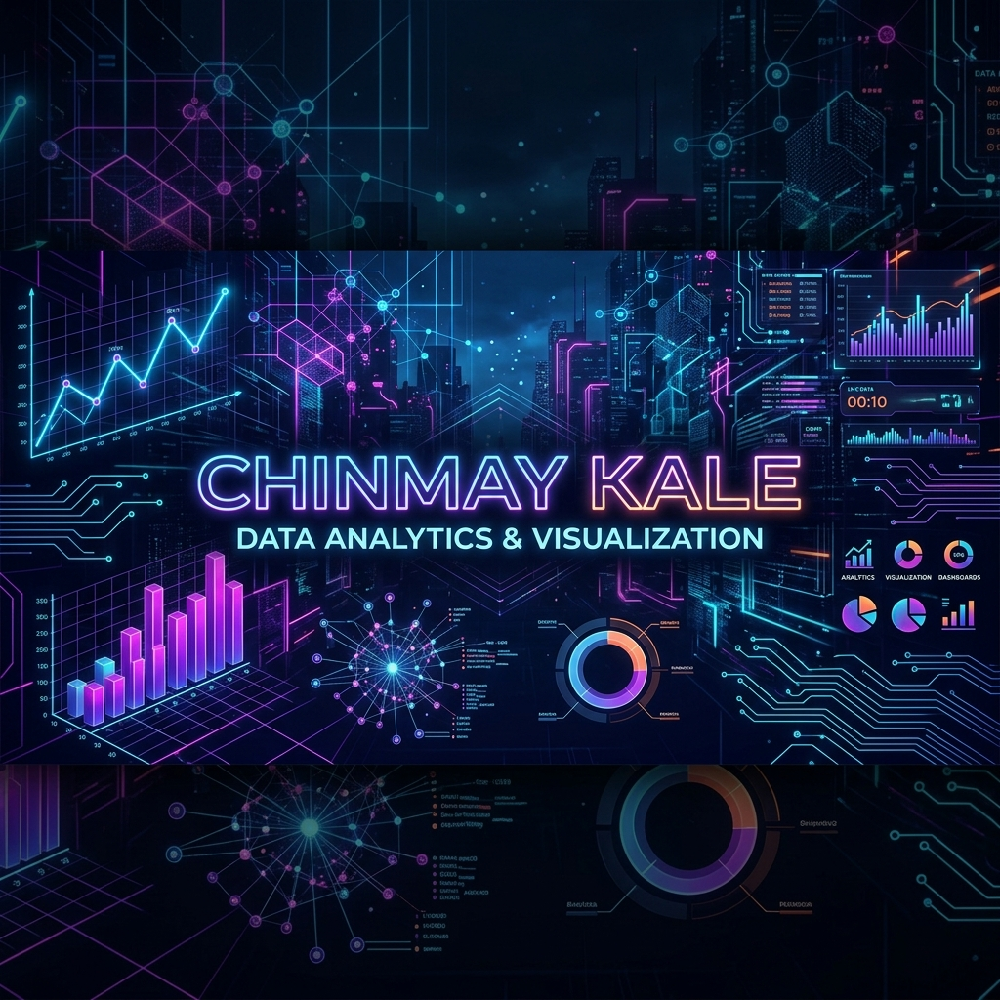

<!-- ═══════════════════════════════════════════════════════════════ -->
<!--               CHINMAY KALE — GitHub Profile README             -->
<!-- ═══════════════════════════════════════════════════════════════ -->

<!-- ══ HERO BANNER ══ -->
<div align="center">



</div>

<!-- ══ ANIMATED TYPING ══ -->
<div align="center">

[](https://git.io/typing-svg)

</div>

<!-- ══ PROFILE BADGES ══ -->
<div align="center">

[](https://github.com/Kalechinmay2001)
[](https://github.com/Kalechinmay2001?tab=followers)
[](https://github.com/Kalechinmay2001)

</div>

---

<!-- ══════════════════════════════════════════ -->
<!--  1. ABOUT ME                              -->
<!-- ══════════════════════════════════════════ -->

## 🧠 About Me


```python
class ChinmayKale:
    name      = "Chinmay Kale"
    role      = "Data Analyst & Power BI Developer"
    education = "B.Tech @ Dr. D.Y. Patil University"
    location  = "Pune, Maharashtra, India 🇮🇳"

    focus     = [
        "Data Analytics", "Power BI Dashboards",
        "SQL Server Database", "Python Scripting"
    ]
    building  = [
        "Interactive Analytics Dashboards",
        "ETL Pipelines & Database Models",
        "Statistical Spending Behavior Models"
    ]
    currently = [
        "Placement Prep & Industry Projects",
        "Advanced Power BI Visualizations",
        "Big Data Analytics and SQL Query Optimization"
    ]

    quote = "Transforming raw data into actionable business insights. 📊🚀"
```

<br/>

<div align="left">
  <a href="https://github.com/Kalechinmay2001" target="_blank">
    
  </a>
  &nbsp;&nbsp;
  <a href="https://github.com/Kalechinmay2001/kalechinmay2001/tree/main/certificates" target="_blank">
    
  </a>
  &nbsp;&nbsp;
  <a href="https://www.linkedin.com/" target="_blank">
    
  </a>
  &nbsp;&nbsp;
  <a href="mailto:email@domain.com" target="_blank">
    
  </a>
</div>

<br clear="right"/>

---

<!-- ══════════════════════════════════════════ -->
<!--  2. TECH STACK                            -->
<!-- ══════════════════════════════════════════ -->

## 🛠️ My Tech Stack

---

### 📊 Data Analytics & Visualization

[]()
[]()
[]()
[]()
[]()
[]()
[]()

---

### 🐍 Languages & Databases

[]()
[]()
[]()
[]()

---

### 🌐 Frontend & General Tools

[]()
[]()
[]()
[]()
[]()
[]()

---

<!-- ══════════════════════════════════════════ -->
<!--  3. FEATURED PROJECTS                     -->
<!-- ══════════════════════════════════════════ -->

## 🚀 Featured Projects

<table align="center">
  <tr>
    <td width="50%" valign="top">
      <h3 align="center">🛒 Customer Behavior Analysis</h3>
      <div align="center">
        
        
        
      </div>
      <br/>
      <p>Customer segmentation and spending analysis using Python, SQL Server, and Power BI. Built interactive dashboards and identified key factors influencing customer spending behavior.</p>
      <div align="center">
        <a href="https://github.com/Kalechinmay2001/Customer_Behaviour_Analysis"></a>
      </div>
    </td>
    <td width="50%" valign="top">
      <h3 align="center">🚖 Ola Ride Data Analysis</h3>
      <div align="center">
        
        
        
      </div>
      <br/>
      <p>Analyzed ride-booking trends, cancellation patterns, and operational KPIs using SQL, Excel, and Power BI dashboards.</p>
      <div align="center">
        <a href="https://github.com/Kalechinmay2001/Ola-ride-booking-analysis"></a>
      </div>
    </td>
  </tr>
  <tr>
    <td width="50%" valign="top">
      <h3 align="center">🚦 Road Accident Analysis Dashboard</h3>
      <div align="center">
        
        
        
      </div>
      <br/>
      <p>Developed Power BI dashboards to analyze accident severity, high-risk locations, and safety improvement opportunities.</p>
      <div align="center">
        <a href="https://github.com/Kalechinmay2001"></a>
      </div>
    </td>
    <td width="50%" valign="top">
      <h3 align="center">🚀 Upcoming Project</h3>
      <div align="center">
        
      </div>
      <br/>
      <p align="center">A new project focusing on predictive modeling and advanced insights is under construction. Stay tuned!</p>
      <div align="center">
        
      </div>
    </td>
  </tr>
</table>

---

<!-- ══════════════════════════════════════════ -->
<!--  4. GITHUB TROPHIES                       -->
<!-- ══════════════════════════════════════════ -->

<div align="center">

## 🏆 GitHub Trophies

[](https://github.com/ryo-ma/github-profile-trophy)

> 💡 **Unlock more:** Make commits → Create PRs → Open issues → Get followers. Trophies auto-update!

</div>

---

<!-- ══════════════════════════════════════════ -->
<!--  5. CERTIFICATIONS & BADGES               -->
<!-- ══════════════════════════════════════════ -->

## 🏅 Certifications & Badges

### 📜 Certifications

| Badge | Certification | Issuer |
|:------|:-------------|:------:|
|  | [Deloitte Data Analytics Job Simulation](certificates/Chinmay%20Deloitte%20Certification%20(1).pdf) | Deloitte / Forage (2026) |
|  | [Power BI Internship](certificates/Chinmay%20Kale%20cognifyz%20kale.pdf) | Cognifyz Technologies (2024) |
|  | [Python for Beginners - Learn Python in Hindi](certificates/Chinmay%20kale%20python%20programming%20certificate%20by%20Udemy.pdf) | Udemy (2025) |
|  | [Internship Common Aptitude Test Participation](certificates/LCAT_Certificate_Chinmay_Kale.pdf) | Labmentix LCAT (2025) |

---

<!-- ══════════════════════════════════════════ -->
<!--  6. ACHIEVEMENTS SHELF                    -->
<!-- ══════════════════════════════════════════ -->

## 🎯 Achievements

<!-- TROPHY SHELF -->
<div align="center">

<table>
  <tr>
    <td align="center" width="220">
      <br/>
      
      <br/><br/>
      <b>Power BI Intern</b><br/>
      <sub>Cognifyz Technologies</sub>
      <br/><br/>
    </td>
    <td align="center" width="220">
      <br/>
      
      <br/><br/>
      <b>Data Analytics</b><br/>
      <sub>Deloitte Job Simulation</sub>
      <br/><br/>
    </td>
    <td align="center" width="220">
      <br/>
      
      <br/><br/>
      <b>Python Certified</b><br/>
      <sub>Udemy programming course</sub>
      <br/><br/>
    </td>
    <td align="center" width="220">
      <br/>
      
      <br/><br/>
      <b>LCAT Candidate</b><br/>
      <sub>Common Aptitude Test</sub>
      <br/><br/>
    </td>
  </tr>
</table>

</div>

---

<!-- ══ GITHUB STATS ══ -->
<div align="center">

## 📊 GitHub Stats


&nbsp;


</div>

---

<!-- ══ ACTIVITY GRAPH ══ -->
<div align="center">

### 📈 Contribution Activity

[](https://github.com/ashutosh00710/github-readme-activity-graph)

</div>

---

<!-- ══ PAC-MAN ══ -->
<div align="center">

### 🟡 Pac-Man Eats My Contributions

<picture>
  <source media="(prefers-color-scheme: dark)" srcset="https://raw.githubusercontent.com/Kalechinmay2001/Kalechinmay2001/output/github-contribution-grid-snake-dark.svg"/>
  <source media="(prefers-color-scheme: light)" srcset="https://raw.githubusercontent.com/Kalechinmay2001/Kalechinmay2001/output/github-contribution-grid-snake.svg"/>
  
</picture>

</div>

<!--
━━━━━━━━━━━━━━━━━━━━━━━━━━━━━━━━━━━━━━━━━━━━
  HOW TO ACTIVATE PAC-MAN (one-time setup):
  STEP 1 — Create .github/workflows/pacman.yml:
  name: Generate Pacman
  on:
    schedule: [cron: "0 0 * * *"]
    workflow_dispatch:
  jobs:
    generate:
      runs-on: ubuntu-latest
      permissions: { contents: write }
      steps:
        - uses: Platane/snk@v3
          with:
            github_user_name: Kalechinmay2001
            outputs: |
              dist/github-contribution-grid-snake.svg
              dist/github-contribution-grid-snake-dark.svg?palette=github-dark
        - uses: crazy-max/ghaction-github-pages@v3
          with: { target_branch: output, build_dir: dist }
          env: { GITHUB_TOKEN: "${{ secrets.GITHUB_TOKEN }}" }
  STEP 2 — Settings → Actions → General → Read and write permissions
  STEP 3 — Actions tab → Run workflow once manually
━━━━━━━━━━━━━━━━━━━━━━━━━━━━━━━━━━━━━━━━━━━━
-->

---

<!-- ══ FOOTER ══ -->
<div align="center">

**⭐ If you find my work useful, drop a star! Let's connect and build something amazing together.**

</div>
